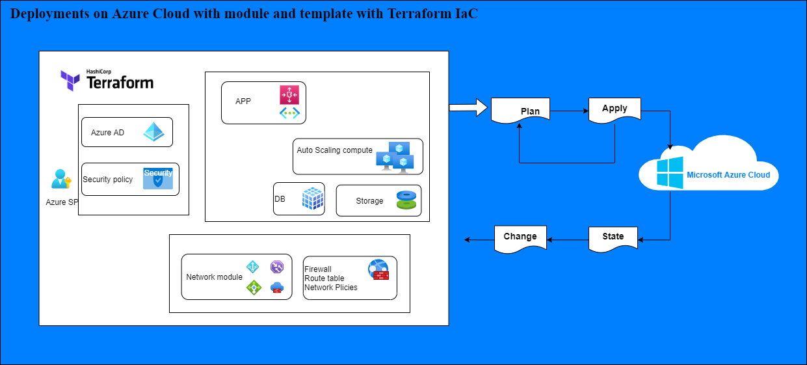

# Build Azure cloud deployment with Terraform modules and template

File Structure
```
- modules
    <module>
        - <module.tf>, variables.tf, output.tf
main.tf
output.tf
variables
```

load credential and parrameter from tfvars file as below
```
azure_client_certificate_path = <client_certificate_path>
azure_subscription_id = <subscription_id>
azure_client_id = <client_id>
azure_tenant_id = <tenant_id>
azure_client_certificate_password = <client_certificate_password>
```
collect credential information or create service principle with az command or console. 

```
az account show
```
```
az ad sp show -id <id>
```
# Create an SP with contributor access to your sub
sp_info=$(az ad sp create-for-rbac \
  --name mr-dr-tacos --role contributor \
  --scopes /subscriptions/$sub_id)
```

### Run terraform 
```
```
terraform plan -var-file <path to tfvars> -out=<stage>.plan
terraform apply <stage>.plan
```


